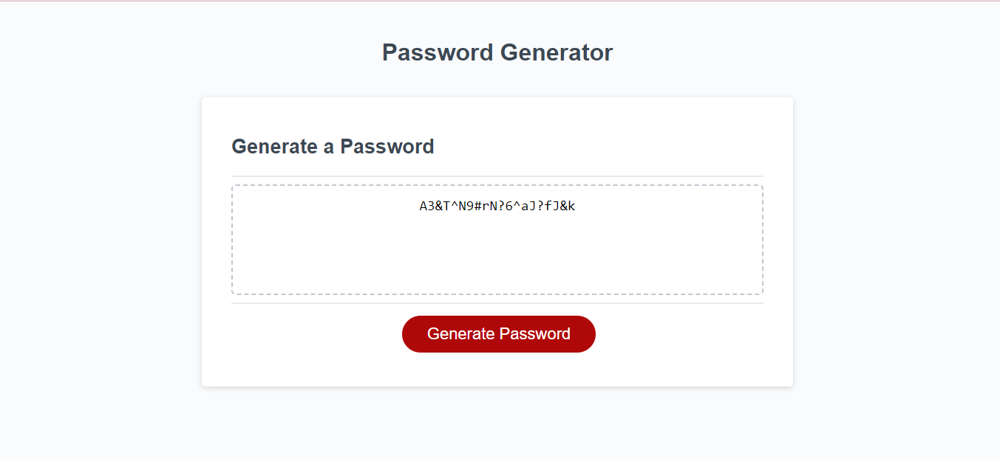

# Password_Generator
Webpage to generate unique passwords

## Description

Password Generator webpage was created for UCF bootcamp class as a webpage for generating a random password. The password is generated from user input of password length and the type of characters used. The webpage was designed to go along with learning and display student ability to utilize knowledge on JavaScript.

## Installation

N/A

## Usage

To use the Password Generator page, load webpage and click the button titled "Generate Password". When the button is clicked, a prompt to input number for the length of the password will pop up. Values entered that do not match the length requirements will result in an alert about requirements then bring the prompt up again. Hitting cancel will close the prompt.

When a value for length that fits the requirements is entered, four questions come up one at a time to ask if the user wants to add lowercase letters, uppercase letters, numbers, or special characters. If none of the character types are selected, the questions will be repeated after an alert about character requirements.

After password details are entered, a password will be generated in the dashed box below "Generate a Password".

Link to the webpage: [Password Generator](https://sienkc.github.io/Password_Generator/)

Screenshot at with generated random password:

## Credits

Majority of content provided by the boot camp creators [UCF Boot Camps](https://bootcamp.ce.ucf.edu/).

## License

Licensed under [MIT](LICENSE)
